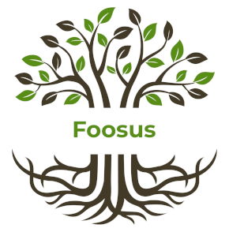

# Repository of Enterprise Architecture

Hello team!

In order to collate our architectural artefacts into one place, we've created this repository which captures our principles, standards, agreements and plans for delivering the next generation of Foosus.

# Content
## Organisational Starting Points

* *[Foosus Project Authorization](./artefacts/Project Authorization.docx)*
* *[Foosus Value Stream Map](./artefacts/organisation/value-stream-map)*

## Foosus Geo-Aware Rebuild Documentation
* *[High Level Business Requirements Document](artefacts/architecture/Geo-Aware-Food-Sourcing-High-Level-Business-Requirements-Brief.pdf)*
* *[Architecture Vision](./artefacts/architecture/vision/)*

## Documentation Pending Completion and Sign Off
These documents need to be collaborated on with the new Guardian for Enterprise Architecture:
* *[Architecture Statement of Work](./artefacts/architecture/statement-of-work)*
* *[Architecture Requirements Specification](./artefacts/architecture/architecture-requirements-specification)*
* *[Architecture Contract with Design and Development](./artefacts/architecture/architecture-contract-development)*
* *[Architecture Contract with Business Users](./artefacts/architecture/architecture-contract-with-business)*

