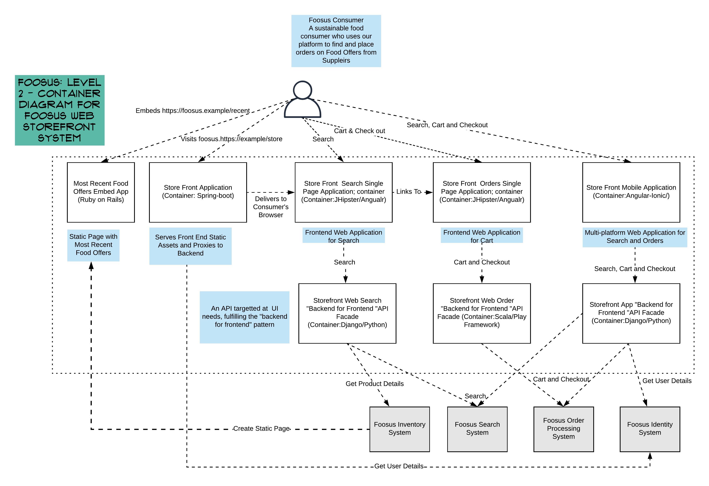

# C4 Model Break Down of Foosus' Legacy Architecture

## Level 1: System Context

This diagram depicts the core system architecture components (which we know about).

In relation to Conveys law, this view also represents the original team structure of Foosus.

## Level 2: Container Level Diagram

This diagram depicts the C4 containers (or applications, in this context), dependencies and distributed relationships involved in satisfying Foosus' Storefront System

The Store Front makes use of the *backend for frontend* design pattern and the spread of behaviour. In practice The Storefront Order Backends are large monolithic applictions which perform more than just ordering.

While Java is the core competency within the platform teams, selected for when hiring, the platform itself includes a wide range of technical choices. These have *organically* come into place with little strategic thinking. A drive towards standardisation in the future be in the best interests of the business as a whole.

*Note that there are various uninventoried applications, services, and scheduled jobs which presumably support these core functions.*

