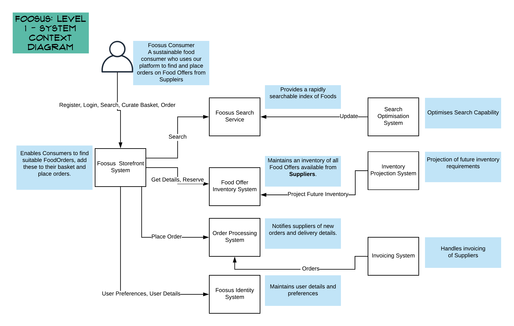

# C4 Model Break Down of Legacy Architecture

## Level 1: System Context

This diagram depicts the core system architecture components (which we know about).

*Note that there are various uninventoried applications, services, and scheduled jobs which presumably support these core functions.*

