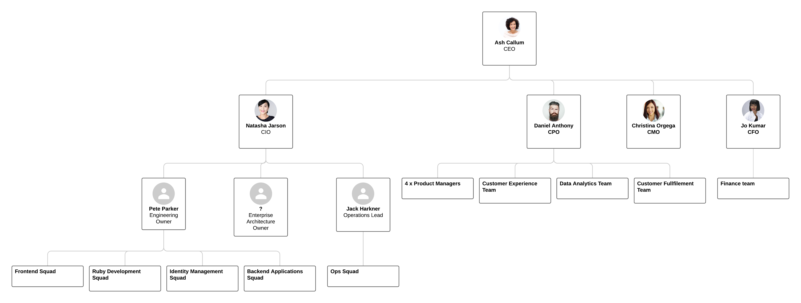

# Foosus Overview

## Current Organisational Structure

While Foosus strives to avoid unnecessary hierarchy we have a implemented a minimal hierarchy to support our self-empowered teams and guide them towards building and developing capabilities required to fullfil Foosus' primary objective of making healthy and sustainable foods available to everyone.

## Organisational Chart

*Download the PDF [version](./org-chart.pdf)*

See Also:[Foosus Value Stream Map](./value-stream-map)
